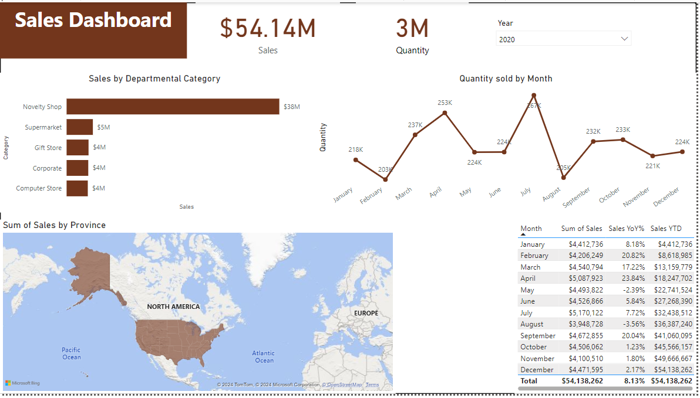

## Super Store Sales Report

## Introduction

This PowerBIprojects provides a comprehensive overview of the Sale performance for an imaginary departmental store called **Super Store**, over a given period of time. The store has 5 departments, Novelty, Supermarket, Gift, Corporate and Computer. The sales dataset was organised and analyzed to answer crucial questions and gain insights to make strategc data driven decisions to improve growth and performance. This project includes organizing and analyzing Invoice and customer information dataset.

You can interact with the project [here](https://app.powerbi.com/links/K-pMlojKy3?ctid=6ca78932-d96b-4bc9-a757-8cbc03f574b9&pbi_source=linkShare)

*__Disclaimer__* : **_All dataset or report do no represent any Company, Institution or Country but its justa dummy dataset used to demonstrate capabilities of PowerBI._**

## Problem Statement
- What is the total revenue generated?
- What is the sales per department?
- What is sales by province?
- What is the sum of quantity sold?

## Skills / Concept demonstrated
I used Power Query to clean and transform the data. Other tools used includes; slicers, filters, Quick measures. Leveraging visualization tools, I created charts, graphs, and pivot tables to showcase key Performance metrics.

## Chart

## Analysis

### Sales by Departmental Category 

This chart reports the total sales value for each departmental category and shows that the highest sales is generated from the Novelty shop ($38m)

### Sales by month

This chart shows the sales value for each month, from January to December. I created two measures, Year to Year percentage (YtoY%) change and sales Year to Date (YtoD) calculation as shown in the table to make comparison with the previous year. The highest quantity sold is recorded in July (267k)

### Sum of Sales by Province

This chart shows the stores sales performance by province. You can drill down into each state/province to identify the individual performance. from this analysis, Texas has the highest sales at #3,564,577

## Recommendation
- Gather customer feedback to identify painpoints and reasons for not shopping at the oher departments
- Explore cross selling strategy by encouraging customers who purchase from the Novelty shop to explore complementary products from other sections at discounted prices. everyone loves discounts!
- Gather customer feedback to identify painpoints and reasons for not shopping at the oher departments
- Allocate more marketing efforts, and inventory to the other departmental category

## Thank you

